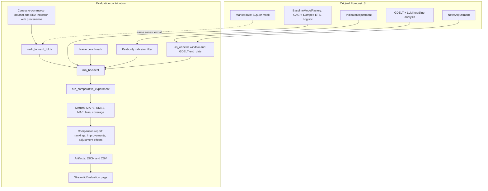

# Contribution to Forecast_S

The Forecast_S project originally provided a Streamlit-based market forecasting framework combining
baseline forecasting models, multiple aggregation methods, GDELT news analysis, LLM integration, and
optional indicators. My contribution extends that system with an empirical, leakage-controlled
out-of-sample evaluation framework.

This document records what existed before my work and what I added. The original code base is
commit `6c30c06`. My work is in the commits that follow it:

| Commit | Content |
|---|---|
| `fb7b3d1` | Ignore rules for local development files |
| `2d7f111` | Walk-forward forecasting evaluation |
| `c78759b` | Leakage-controlled indicator backtesting |
| `196b6b7` | Historical point-in-time news backtesting |
| `d5d810c` | Empirical evaluation framework: comparative experiments, Census dataset, artifacts, dashboard |

User and developer documentation for the whole project is in [README.md](README.md).

---

## Original Project

These capabilities existed before my contribution:

- **Streamlit application.** Multi-page app (Data Extraction, Configuration, Forecasting, Insights, Export) with session state, charts and export.
- **Market forecasting** from a historical cutoff to a target year, with two modes: Forecast + News Adjustment and Existing Forecast + News Adjustment.
- **Forecasting approaches.** Bottom-Up, Top-Down, Country-Specific and Global Only, with regional aggregation through `config/aggregation.json`.
- **Baseline models.** 3-yr CAGR, Damped ETS and Logistic Growth, created by `BaselineModelFactory`.
- **GDELT news retrieval.** Topic-based fetching, globally and per country, with ISO3 → FIPS mapping and rate limiting.
- **LLM news analysis.** Headline classification into categories with growth impacts, LLM-generated categories and topics, and LLM decay calibration (OpenAI-compatible and Ollama providers).
- **Adjustments.** News adjustment with category moving-average windows and temporal decay, indicator adjustment with weights, and fallback strategies for countries with little news.
- **Country and global analysis and visualization** on the Insights page; export of forecasts and analyzed news.
- **Configuration and data pipeline.** `config/` files, SQL extraction via `DB_URL`, and a mock-data generator for demos.

The original project could generate forecasts. It had no way to measure whether those forecasts, or
the news and indicator adjustments, were accurate on data the models had not seen. Metric helpers
existed (`src/forecasting/base/metrics.py`) but were not used for out-of-sample testing. The
repository contained no real historical dataset, only random mock data.

---

## My Contribution

### 1. Walk-Forward Evaluation

- **Expanding-window folds.** `walk_forward_folds` (`src/forecasting/evaluation/splits.py`) builds deterministic folds over consecutive years. Each fold trains on every year up to its origin and tests on the next `horizon` years. Only folds with a complete test horizon are produced.
- **Forecast origins and unseen targets.** For origin `Y`, a fresh model instance is fitted on `year <= Y` and forecasts `Y+1 .. Y+horizon`; those target values are never seen during fitting.
- **Temporal isolation.** Tests alter target, indicator and news values after the origin and assert that the fold's forecasts are unchanged.
- **Naive benchmark.** `NaiveLastValueForecaster` (`backtest.py`) carries the last training value forward. It is evaluated on the same folds and never adjusted.
- **Fold-level failure handling.** A model or adjustment that fails on one fold is logged with a reason and kept with `status = "failed"`. It never stops the run and never enters the metrics.
- **Chronological fitting.** I made one small fix in `BaseForecaster` (`src/forecasting/base/models.py`): history is sorted by year before fitting, because the models read the series positionally.

### 2. Model Comparison

- **Models.** Naive (last value), 3-yr CAGR, Damped ETS and Logistic Growth are compared on identical folds. The production models themselves are unchanged.
- **Metrics.** MAPE, RMSE, MAE, bias (`mean(predicted - actual)`), absolute bias, and the mean, median and standard deviation of errors.
- **Horizon-level analysis.** Each horizon (1, 2, 3 years) is summarized separately and pooled over all horizons.
- **Pooled vs. fold-mean.** Both aggregations are produced and always labeled.
- **Rankings.** `rank_models` ranks per metric. Models below a minimum coverage are listed last and are not eligible as "best".

### 3. Leakage-Controlled Indicator Evaluation

- **Point-in-time indicators.** The production app passes indicator data that extends into the forecast years. The evaluation variant `indicator_adjusted_past_only` filters indicator rows to `year <= origin` before calling the **unchanged** production `IndicatorAdjustment`.
- **No silent zeros.** A fold where a weighted indicator has no observable growth through the origin is marked `failed`, not scored as zero adjustment.
- **BEA goods consumption.** I evaluated BEA Personal Consumption Expenditures — Goods (nominal, series `DGDSRC`) against the Census target.
  - **Fixed weights:** indicator weight 1.0 and overall indicator weight 0.3, chosen before the run and not tuned.
  - **Provenance:** the indicator was extracted from the official BEA bulk file and cross-checked against FRED.
- **Excluded indicator.** A second candidate, World Bank U.S. internet users, was excluded because it failed a documented source-change and break inspection.
- **Comparison against baseline.** Effects are paired comparisons of each adjusted forecast with the same model's baseline forecast. They include wins/losses, a bias decomposition and a fixed-nudge diagnostic.

Result: the BEA goods-consumption indicator did not provide meaningful predictive value under the
existing adjustment formula. Small changes in MAPE/MAE were largely consistent with bias correction
rather than clear additional predictive information.

- RMSE got worse for all three models, and 3-yr CAGR got worse on every metric.
- The applied adjustment was a nearly constant +0.93% to +1.34% at every origin.
- All paired wins were on forecasts the baseline had under-predicted.
- Multiplying every baseline by the fixed mean factor did slightly better than the indicator itself.

### 4. Historical News Evaluation Infrastructure

- **Historical as-of timestamps.** `news_as_of(Y)` defines the information cutoff as `Y-12-31 23:59:59` UTC.
- **Point-in-time `NewsAdjustment`.** I added an optional `as_of` and `lookback_days` to the production `NewsAdjustment` (`src/forecasting/adjustments/news_adjustment.py`). Only headlines in `[as_of - lookback_days, as_of]` are used, and recency weights and category windows are measured from `as_of` instead of the current time. With `as_of=None` (the default), production behavior is unchanged.
- **GDELT end-date control.** The GDELT fetchers in `src/news/gdelt.py` accept an optional `end_date` and drop articles outside the historical window. The default behavior is unchanged.
- **Historical windows.** `fetch_headlines_for_origins` fetches the window ending at each origin and de-duplicates the results.
- **Caching.** `HeadlineAnalysisCache` and `analyze_headlines_cached` analyze each headline at most once per prompt/model fingerprint.
- **Failed-analysis handling.** Failed LLM analyses raise `HeadlineAnalysisError` and are never cached, so they are not mistaken for zero impact.
- **Historical replay variant.** The `news_adjusted_historical` evaluation variant uses supplied, already-analyzed headlines. Folds without headlines in their window are marked `failed`.

No empirical claim is made that news improved forecast accuracy, because sufficiently archived
historical analyzed-news data was not available for a robust long-horizon effectiveness test.
The GDELT DOC API covers only about the last three months, and a modern LLM may interpret old
headlines with hindsight. Both limitations are documented.

### 5. Real-World Evaluation Dataset

I built a real target series, U.S. Census Bureau annual retail e-commerce sales
(`scripts/build_census_ecommerce_dataset.py`):

- **Coverage:** 2000–2025, 26 consecutive annual observations, in millions of current US dollars.
- **Construction:** each annual value is the sum of the four not-seasonally-adjusted quarters from the Census Quarterly E-Commerce Report. Incomplete years (1999, 2026) are excluded.
- **Vintage:** current-vintage source (workbook revised August 18, 2026), including the April 2025 methodology restatement. It is documented as **not** a real-time vintage dataset.
- **Provenance:** unmodified official workbooks with SHA-256 hashes, per-year quarterly values and revision flags, and a seasonally adjusted cross-check.
- **Validation:** checks for exactly 26 observations, consecutive unique years, and finite non-negative values, recorded in the metadata.

Evaluating on real official data matters. The original repository only had random mock data, and
results on synthetic series say nothing about real markets. The experiment API requires an
explicit `is_synthetic` flag and labels synthetic runs `DEMO/SYNTHETIC`.

### 6. Evaluation Experiment Framework

- **`ExperimentConfig`.** A frozen record of dataset name, synthetic flag, models, horizon, minimum training years, step, origins, and indicator and news settings.
- **`ExperimentResult`.** Fold-level records, a failure log and metadata, including input fingerprints, evaluated horizons, origins and limitations.
- **`run_comparative_experiment`.** Runs every model and variant on one shared set of folds and records any horizon reduction for short series.
- **Summaries.** Pooled and fold-mean metrics per model, variant and horizon, plus an all-horizon pool.
- **Pairwise improvements.** `benchmark_improvements` compares against the naive benchmark; `adjustment_effects` compares against the model's own baseline. Both are paired on identical forecasts and report wins, losses and ties.
- **Coverage and failures.** Attempted, successful and failed folds and coverage per group.
- **`build_comparison_report`.** Rankings, best entries by metric and horizon (coverage ≥ 80%), and findings that state measured changes only.
- **Result export.** `export_json` and `export_csv`.

### 7. Evaluation Artifacts

Stored in `data/evaluation/results/census_baseline/` and
`data/evaluation/results/census_indicators/spec_a_goods/`:

| Artifact | Content |
|---|---|
| `experiment_result.json` | Full result: configuration, metadata, summaries, comparisons, records, failures |
| `experiment_metadata.json` | Dataset, validation, models, origins, settings, fingerprints, methodology notes, limitations |
| `summaries.csv` | Pooled and fold-mean metrics per model, variant and horizon |
| `records.csv` | One row per fold, model, variant and target year |
| `improvements.csv` | Paired improvements vs. benchmark (and vs. baseline for the indicator variant) |
| `failures.csv` | Failure log (empty in both experiments) |
| `comparison_report_pooled.json`, `comparison_report_fold_mean.json` | Rankings, best entries, findings |
| `breakdown_by_target_year.csv`, `breakdown_by_target_period.csv` | Descriptive error breakdowns (baseline) |
| `indicator_adjustment_by_origin.csv`, `indicator_effect_vs_baseline.csv`, `indicator_effect_by_target_period.csv` | Indicator diagnostics |
| `census_indicators/run_log.json` | Which indicator specifications were run or skipped, and why |

Provenance for the inputs is stored with the datasets (`data/evaluation/*metadata.json`,
`data/evaluation/indicators/*provenance.json`, `data/evaluation/raw/indicators/fetch_log.json`).
SHA-256 fingerprints of the target and indicator inputs are recorded in the experiment metadata.

### 8. Streamlit Evaluation Page

I added `pages/06_Evaluation.py` (sidebar entry **Evaluation**, page title "Model Evaluation"), with
rendering in `pages/components/evaluation.py` and read-only loading in
`src/forecasting/evaluation/artifacts.py`. The page shows:

- **Summary:** experiment setup and a current-vintage warning.
- **Model comparison:** a MAPE/RMSE/MAE/bias/coverage table, switchable between pooled and fold-mean, with the best value per horizon highlighted. No overall winner is declared.
- **Horizon charts:** MAPE, RMSE and MAE versus horizon.
- **Indicator evaluation:** baseline vs. adjusted tables and chart, a bias diagnostic, the adjustment factor by origin, and the fixed-nudge comparison.
- **Regime diagnostic:** errors by target period around the pandemic.
- **News limitation:** a statement that historical news was not evaluated empirically, and why.
- **Methodology** notes.
- **Downloads** of the stored files, also offered on the Export page.

All values are read from the stored artifacts. The page performs no database, GDELT, LLM or network
access, never reruns an experiment, and shows a clear message instead of results if files are missing.

### 9. Testing

| Test file | Tests | Scope |
|---|---|---|
| `tests/test_backtest.py` | 94 | Folds, backtest, naive benchmark, failure handling, temporal isolation, indicator and news point-in-time variants, headline cache |
| `tests/test_experiment.py` | 26 | Comparative experiment, metrics aggregation, rankings, improvements, export |
| `tests/test_evaluation_artifacts.py` | 16 | Stored-result loading, columns, missing files, metric parsing, best-model selection, indicator comparison |

- **Evaluation-specific tests:** 136/136 passed.
- **Full suite** (`pytest -q --continue-on-collection-errors`): 142 passed, 3 failed, 1 error.
- **Pre-existing failures:** all four are in legacy tests from the original code base (`test_forecasting_pipeline.py`, `test_smoke.py`, `test_headline_analysis.py`). They were failing before my work and were deliberately left unchanged; [README.md](README.md#running-tests) lists the causes.

---

## Original vs. Contribution

| Area | Original Forecast_S | My contribution |
|---|---|---|
| Forecast generation | Yes | Unchanged; evaluated out-of-sample |
| 3-yr CAGR | Yes | Evaluated out-of-sample |
| Damped ETS | Yes | Evaluated out-of-sample |
| Logistic Growth | Yes | Evaluated out-of-sample |
| Naive benchmark | No | Added |
| Walk-forward evaluation | No | Added |
| Horizon evaluation | No | Added |
| MAPE/RMSE/MAE comparison | Metric helpers only, not used for out-of-sample testing | Added |
| Temporal leakage controls | No | Added |
| Historical indicator evaluation | No | Added |
| Historical news replay | No (news windows measured from the current date) | Added (`as_of`, GDELT `end_date`, cache) |
| Real Census evaluation dataset | No (mock data only) | Added |
| Evaluation artifacts | No | Added |
| Evaluation Streamlit page | No | Added |
| Evaluation tests | No | Added (136 tests) |

---

## Technical Architecture

The contribution reuses the original models and adjustment formulas unchanged and wraps them in a
time-respecting evaluation layer. The arrows into `run_backtest` show which original components are
exercised under point-in-time constraints.

---

### Summary

The original project was a forecasting application. It could generate baseline forecasts, combine
them across countries and regions, and adjust them with news and indicators, but it could not show
whether any of those forecasts were accurate.

My work turns it from a system that primarily generates forecasts into one that can also test,
empirically, whether those forecasts work on unseen historical observations. The contribution adds:
- reproducible evaluation;
- strict temporal isolation of training data, indicators and news;
- benchmarking against a naive forecast;
- leakage controls and historical replay infrastructure;
- a real, provenance-tracked evaluation dataset;
- comparative analysis across models, horizons and adjustments;
- reporting in a dashboard;
- a dedicated test suite.

The contribution is evaluation and scientific validation, not another forecasting model. Its main
empirical results are deliberately reported as measured:
- Damped ETS and Logistic Growth beat the naive benchmark but lead on different metrics.
- The BEA goods indicator added no meaningful predictive information under the existing formula.
- News effectiveness could not be tested for lack of archived historical news data.

Negative and inconclusive results are useful evidence: they show where the original system's
assumptions hold and where they do not.
